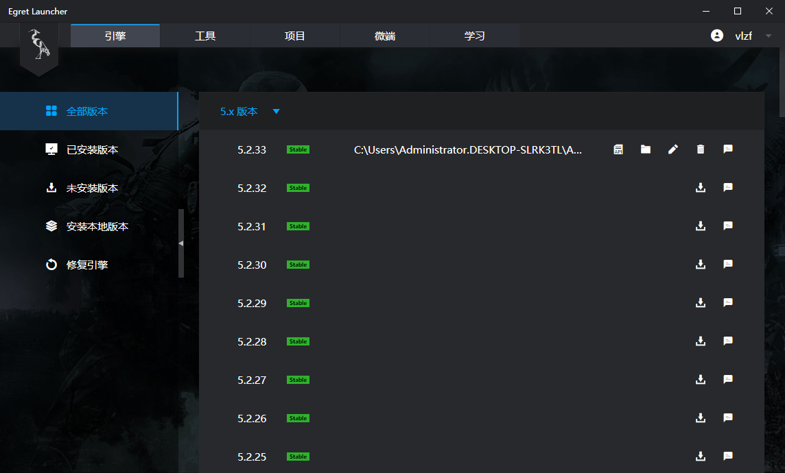

# Egret 环境配置

### 1、安装 Egret Launcher
* 浏览器打开官方下载页面[https://docs.egret.com/engine](https://docs.egret.com/engine)
* 点击“下载 Egret Launcher”按钮

* 打开安装文件，安装到任意位置

### 2、安装 Egret 引擎
* 打开 Egret Launcher 软件，注册账号并登录
* 在引擎页面选择其中一个版本的引擎下载

### 3、安装 Egret Wing
* 打开工具页面，下载并安装 Egret Wing (安装位置自己选)

