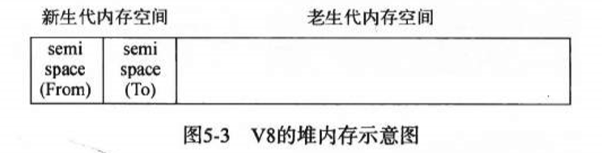
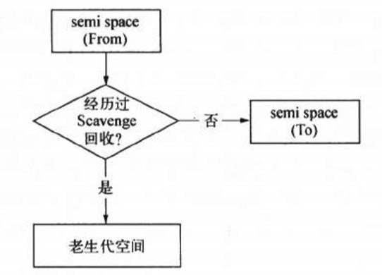
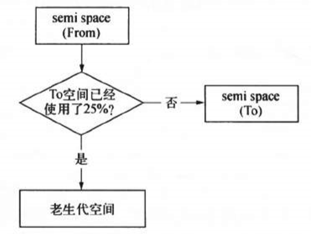
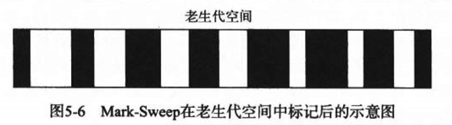
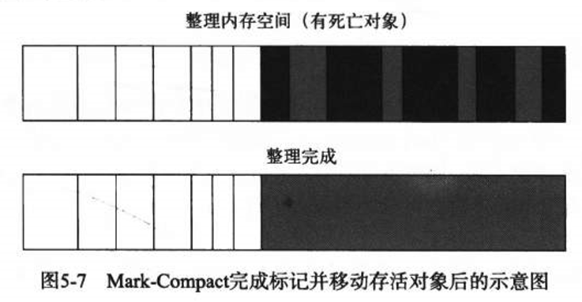
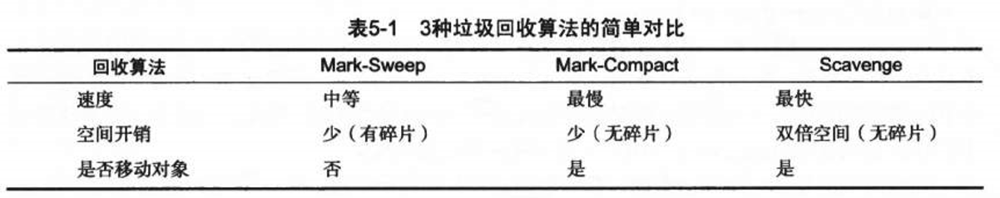
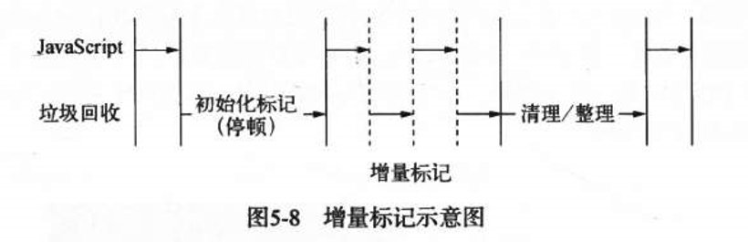

# V8 垃圾回收机制

## 一、V8 内存限制
V8 引擎能够分配和管理的内存是有限制的，在 64 位系统下约 1.4G，32位系统中约 0.7G。也就是说，V8 引擎没办法将一个 2G 的文件读入内存进行字符串处理。

#### 为何有这种限制？
- 表层原因：  
V8 最初是为浏览器而设计的，不可能会遇到使用大量内存的场景。对于网页来说，V8 的限制已经绰绰有余了。

- 深层原因：  
V8 垃圾回收机制的限制。内存越大，单次的垃圾回收所需时间就越长。而垃圾回收时又会阻塞 js 线程，导致应用假死。长时间的假死是前端浏览器和后端服务都无法接受的。所以，直接限制内存堆是一个很好的选择。

***

## 二、V8 的内存分代
V8 的垃圾回收主要基于分代式垃圾回收机制。所谓“分代式垃圾回收机制”就是，不同的情况（对象生存周期长或短）用不同的处理方法。

这样做的原因是：
1. 目前还不存在一种垃圾回收算法可以胜任所有场景。
2. 不同的算法只能针对特定情况具有最好的效果。

### V8 的内存主要分为两代：新生代、老生代
- 新生代：新生代中的对象为存活时间较短的对象占大部分。用 Scavenge 算法处理。
- 老生代：老生代中的对象为存活时间较长的对象占大部分。用 Mark-Sweep 和 Mark-Compact 算法处理。

  

***

## 三、Scavenge 算法
在分代的寄出上，新生代中的对象主要通过 Scavenge 算法进行垃圾回收。Scavenge 具体使用了 Cheney 算法。

### Cheney 算法：
Cheney 算法是一种采用了复制方式实现的垃圾回收算法。它将新生代内存分为两个semispace 空间，一个处于使用状态的 From 空间（别称），一个处于闲置状态的 To 空间（别称）。

分配对象时，会先在 From 空间开始分配。  
当垃圾回收时，会检查 From 空间中的存活对象，并将存活对象复制到 To 空间中，然后将 From 空间的所有对象全部释放。  
最后，From 空间和 To 空间角色交换（即 From 空间变 To 空间，To 空间变 From 空间）。

- 优点：  
因为新生代中以非存活对象为主，存活对象只占少部分。所以，选取复制存活对象比较方便，剩下的就可以全部删除。这种算法适用于生命周期较短的对象占比大的情况。  

- 缺点：  
但由于会把堆内存一分为二，内存只用了一半，内存利用率低。典型的牺牲空间换区时间的算法。

***

## 四、晋升
分配对象时，都是先在新生代的 From 空间开始分配，那老生代中的对象是从哪来的呢？  
老生代中的对象是由新生代的对象通过晋升得来的。

在一定条件下，需要将存活周期长的对象移动到老生代中，也就是完成对象晋升。  
对象晋升的条件主要有两个：
- 对象是否经历过 Scavenge 回收。
- To 空间的内存占用比例超过限制。

  
  

***

## 五、Mark-Sweep 和 Mark-Compact 算法
对于老生代中的对象，由于存活对象占的比重较大，使用 Scavenge 算法，复制大量存活对象会出现效率很低的问题，而且还要浪费一半内存；因此，老生代使用 Scavenge 算法是不明智的。

对于老生代中的对象，由于存活对象占的比重较大，非存活对象占的比重较小，处理非存活对象会更方便、更有效率。

***

### Mark-Sweep 算法也就是标记清除算法。它分为标记、清楚两个阶段：
1. 标记阶段：遍历老生代的所有对象，并标记存活对象。
2. 清除阶段：释放 From 空间内存（即清除非存活对象）。

- 缺点：
Mark-Sweep 算法最大的问题是进行一次标记清除后，内存空间会出现不连续的状态（也就是出现内存碎片），这会导致内存浪费。  
黑色是死亡对象被清除后留下的空白空间，白色是存活对象：  
  

为了解决这个问题，Mark-Compact 算法就被提出来了。

***

### Mark-Compact 算法就是标记整理。它就是在 Mark-Sweep 算法的基础上，在标记阶段和清除阶段之间添加了一个整理阶段：
1. 标记阶段：遍历老生代的所有对象，并标记存活对象。
2. 整理阶段：将被标记的对象往一端移动（剩下的非存活对象也自然会往另一端集中）。
3. 清除阶段：根据存活对象的边界，直接清除边界外的内存（即清除非存活对象）。

  

- 缺点：由于增加了整理阶段，要移动对象，时间耗费很大。

***

### 3种垃圾回收算法对比
  

综合 Mark-Sweep 和 Mark-Compact 算法各自的优缺点。老生代内存管理一般采用 Mark-Sweep 算法，只有当老生代内存不足的时候才使用 Mark-Compact 算法整理内存，之后再用回 Mark-Sweep 算法，如此循环。

***

## 六、增量标记
增量标记是用于优化老生代垃圾回收的标记阶段。它将老生代的一次垃圾回收过程分成若干次完成，每分成一小部分就让 js 应用逻辑执行一小会，垃圾回收与应用逻辑交替执行直到标记阶段完成。  
  

#### 为什么 js 应用逻辑与垃圾回收不能同时进行呢？
> 《深入浅出Node.js》：为了避免出现 Javascript 应用逻辑与垃圾回收器看到的不一致的情况，垃圾回收的 3 种基本算法都需要将应用逻辑暂停下来，待执行完垃圾回收后再恢复执行应用逻辑，这种行为被称为“全停顿”（stop-the-world）。

理解起来也很简单，无论垃圾回收还是应用逻辑，他们都会改变内存里的内容。应用逻辑与垃圾回收同时进行，就如同两个程序员同时写同一个文件；如果他们是各自做各自的本分还好，但问题就是他们不仅同时相互改动对方的内容，而且还毫无交流，然后他们通过版本控制器把文件合并了，最后的结果可想而知，一堆 bug 和报错。

而阻塞进行就可以避免这个问题。但随之而来的当然是过长的“全停顿”导致应用假死。新生代的存活对象少，垃圾回收时间短，所以对应用不会有太大的影响；但老生代存活对象多，垃圾回收处理时间长，是导致应用假死的主要原因，所以才需要增量标记来分散假死时间。

***
参考：
> 《深入浅出Node.js》

***

END

