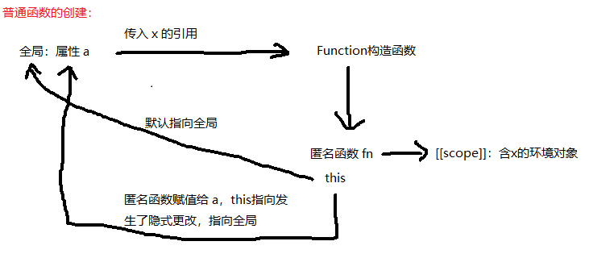
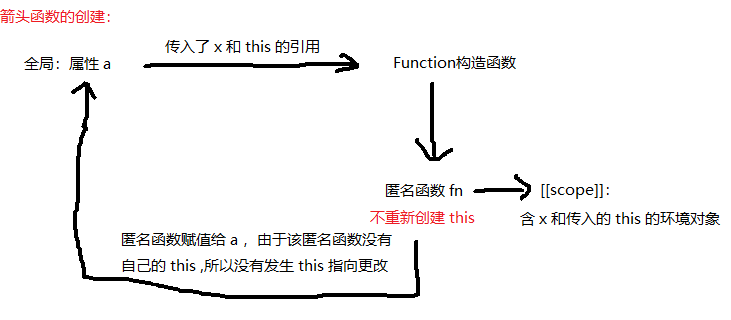

# 函数创建

创建函数我们都会，比如：
```js
function fn(){
    return 'Hello World!'
}
fn() // "Hello World!"
```
似乎没什么好讲的，才怪！
******************************

## 一、Function 构造器
函数其实就是一个对象：
```js
function fn(){
    return 'Hello World!'
}
typeof fn // "function"
fn instanceof Object // true
```
既然函数是对象，那函数是谁创建的呢？
```js
fn.constructor  // Function
```
函数是由 Function 构造函数创建的。也就是说，当我们声明一个函数时，就相当于使用 Function 构造函数实例化了一个函数对象。  
从[关键字 this 篇](https://github.com/vlzf/personalNotes/blob/master/js-base-note/%E5%85%B3%E9%94%AE%E5%AD%97this.md)跑过来的人可能已经不耐烦了，回归正题吧。

*********************************

## 二、函数创建过程
### 1. 普通函数
先看这一个代码：
```js
var x = 1
function a(){
    var y = x
    console.log(this.x, y)
}
// 等价与
var a = function(){
    var y = x
    console.log(this.x, y)
}
```
在创建函数 a 创建时，由于函数 a 是在全局声明的，所以，在全局先调用 Function 构造函数。然后，就传入参数一样传入了 x 的引用（不是 x 的副本），而 y 是在函数 a 执行时才创建的，此时并没有创建。因为 Function 构造函数是一个全局函数，当它实例化一个函数并且为该实例函数绑定 this 的时候，只能将实例函数的 this 指向全局环境，一个匿名函数就创建好了。然后，再将该匿名函数赋给了变量 a。由于赋值给 a 的过程中，并没有发生 this 的重定向，所以，最后的 this 依旧指向全局。x 所在的环境将被记录到新函数的 [[scope]] 中。



所有函数刚被创建出来的时候，this 都是指向全局的，在赋值的时候 this 的指向才有可能会被隐式更改。


再看回这个代码是不是已经变得很简单啦：
```js
var x = 1
var obj = {
    x: 'obj',
    a: function a(){
        var x = 'a'
        function b(){
            var x = 'b'
            return this.x
        }
        return b()
    }
}
obj.a() // 1
```

### 2. 箭头函数
箭头函数是 ES6 的语法。之前我们说过，箭头函数的 this 的指向是不能被更改的。
先看下面的代码：
```js
var x = 1
var obj = {
    x: 'obj',
    a: function a(){
        var x = 'a'
        var b = ()=>{ // 注意这里
            var x = 'b'
            return this.x
        }
        return b()
    }
}
obj.a()
```
执行完后是不是又懵逼了。箭头函数的创建跟普通函数稍微有点不一样。

首先，函数 a 执行，声明箭头函数，调用 Function 构造函数，将函数 a 的 this 的引用传入 Function，创建匿名函数，但不为匿名函数创建自己的 this，因此，该函数只能使用传入来的 this。

我们用一个更加简单的例子来说明箭头函数的创建过程：
```js
var x = 1
var a = ()=>{
    var y = x
    console.log(this.x, y)
}
var b = function(){
    var y = x
    console.log(this.x, y)
}
var obj = {
    x: 2,
    a: a,
    b: b
}
obj.a()
obj.b()
```




再看一个例子：
```js
var x = 1
var fn = () => {
    return this.x
}
var obj = {
    x: 2
}
fn.apply(obj)
```
我们会发现，箭头函数的 this 是没有办法被更改的。
因为无论显示更改还是隐式更改，都只能更改函数自身的 this，而箭头函数的 this 不是自己的，而是像普通变量一样从外部引进来的。

*******************************
## 三、例子
例1：
```js
var length = 1
function fn(){
    console.log(this.length)
}
var obj = {
    length: 2,
    f: function(fn){
        fn()
        arguments[0]()
    }
}
obj.f(fn, 1, 2, 3)
```
例2： 
```js
var x = 1
var obj = {
    x: 2
}
obj.fn = ()=>{
    return this.x
}
obj.fn()
```
例3：
```js
var length = 100
var a = [
    1,
    2,
    3,
    ()=>{ return this.length }, 
    function(){ return this.length }
]
a[3]()
a[4]()
```
例4：
```js
var x = 1
var obj = {
    x: 2,
    fn: function(){
        var x = 3
        return ()=>{
            var x = 4
            return function(){
                return this.x
            }.apply(this)
        }
    }
}
obj.fn()()
```

****************************

## 四、总结
1. 所有函数都是通过 Function 构造函数创建的。
2. 所有函数自身的 this 最开始都是指向全局的，除非它没有自己的 this。
3. 所有函数刚创建出来的时候都是匿名函数。
4. 把匿名函数赋值给变量的时候，普通函数可能会发生 this 指向更改，而箭头函数不会。
5. 只有函数拥有自己的 this 才能发生 this 指向更改。


**************************
END
 