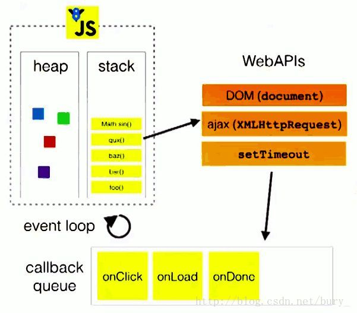
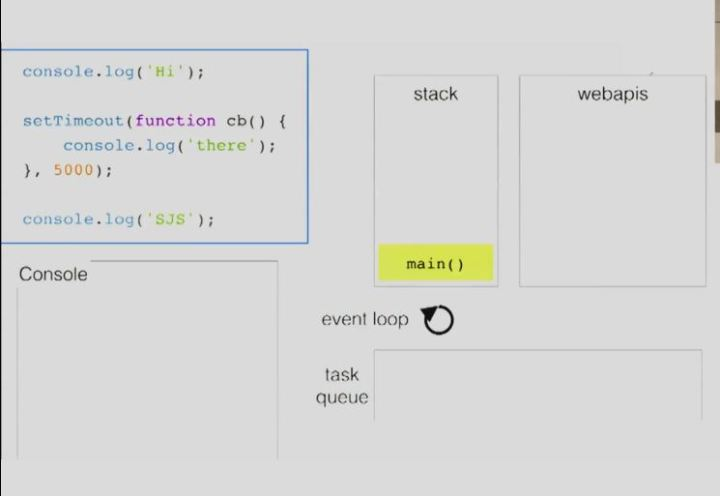
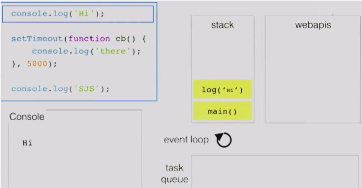
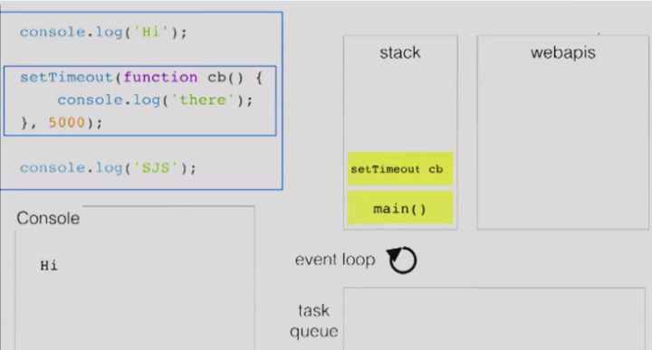
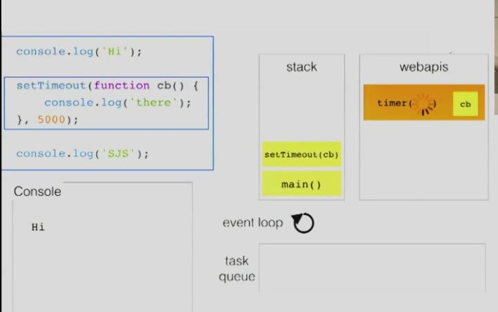
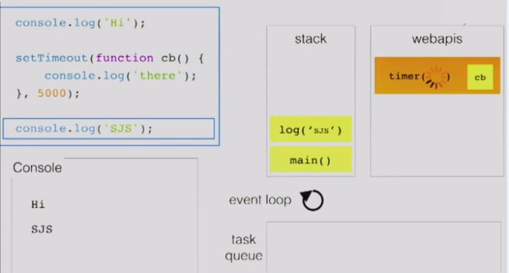
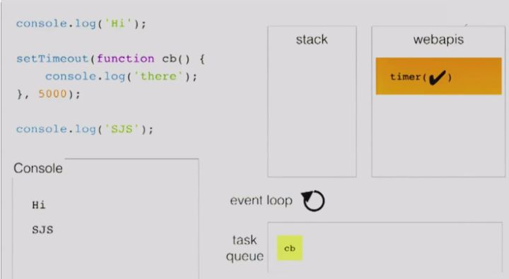
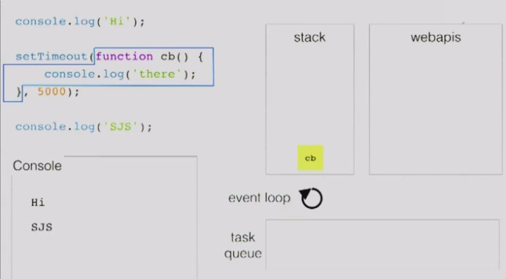
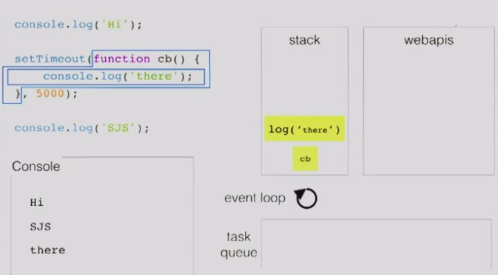

# 浏览器的事件循环机制

## 前言
js 是单线程的，所有代码都在主线程完成执行。但是，由于 js 有同步和异步操作，那么它是如何确定程序的执行顺序的？

***

## 一、分块的程序
js 是一种分块的程序，一个 js 文件由有多个块构成，程序分块执行。
```js
function now(){
    console.log('now')
}
function later(){
    console.log('later')
}
now()
setTimeout(later, 1000)
```
一个代码有两块：现在执行的部分、将来执行的部分。

现在：
```js
function now(){/*...*/}
function later(){/*...*/}
now()
setTimeout(/*...*/)
```
将来：
```js
console.log('later')
```

***

## 二、事件循环
js 引擎是做什么的？它是在需要的时候，在给定的任意时刻执行程序中的单个代码块。

js 引擎并不是独立运行的，它运行在宿主环境中。这些环境都有一个共同 “点”，即它们都提供一种机制处理程序中多个块的执行，且执行每个块时调用 js 引擎，这种机制被称为`事件循环`。

那么，浏览器的`事件循环`又是如何实现的？如图：



如图所示，它有一个`执行栈`（stack）和一个（或多个）`任务队列`（callback queue）。当执行栈内的代码执行时，若调用到 DOM 操作、异步请求、定时器设置等 api 时，会将异步执行的代码块放入任务队列。当监听到执行栈为空时，从任务队列取出第一个任务放入执行栈执行。类似于：
```js
var eventLoop = [] // 任务队列
var event // 当前执行任务
while(true){
    if(!event && eventLoop.length > 0) {
        event = eventLoop.shift()
        event()
        event = null
    }
}
```

这里引用 [https://zhuanlan.zhihu.com/p/26229293](https://zhuanlan.zhihu.com/p/26229293) 的几张图：


















***

## 三、任务队列中的`宏观任务`和`微观任务`
之前说过，任务队列可能不止一个。不同的任务对应着不同的任务队列。任务可以分为`宏观任务`和`微观任务`，`宏观任务`放入`宏观任务`队列，`微观任务`放入`微观任务`队列。两种任务队列有什么不同呢？ 

在执行栈为空的时候，会先优先从`微观任务`队列中调入任务，当`微观任务`队列清空时才会执行`宏观任务`队列中的任务。类似于：
```js
var microTask = [] // 微观任务队列
var macroTask = [] // 宏观任务队列
var event // 当前执行任务

while(true){
    if(!event) {
        if(microTask.length) {
            event = microTask.shift()
        } else if(macroTask.length) {
            event = macroTask.shift()
        }
        event()
        event = null
    }
}
```
> macro-task 包括：script (整体代码), setTimeout, setInterval, setImmediate, I/O, UI rendering  
> micro-task 包括：process.nextTick, Promises, Object.observe, MutationObserver, MessageChannel

例子：
```js
var timer = setInterval(()=>{
    console.log('setInterval')
}, 0)

setTimeout(()=>{
    console.log('setTimeout-1')

    Promise.resolve().then(()=>{
        console.log('Promise-2')
    }).then(()=>{
        console.log('Promise-3')
    })

    setTimeout(()=>{
        console.log('setTimeout-2')
        clearInterval(timer)
    },0)
}, 0)

Promise.resolve().then(()=>{
    console.log('Promise-1')
})
```
输出结果：
```js
'Promise-1'
'setInterval'
'setTimeout-1'
'Promise-2'
'Promise-3'
'setInterval'
'setTimeout-2'
```

***
END