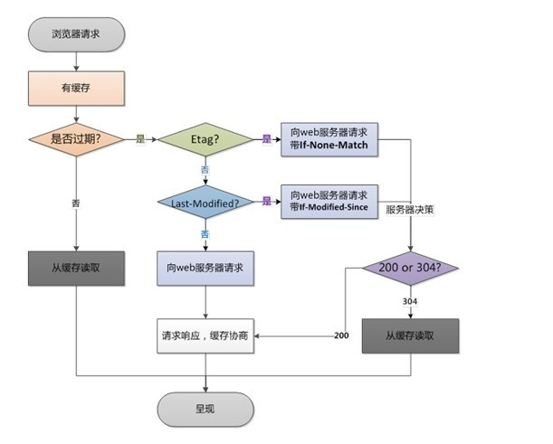

# 浏览器缓存策略

## 前言
浏览器的缓存策略到底是用来做什么的？  
浏览器缓存也就是 http 缓存。该缓存策略是服务器端来进行配置的。它是用来尽可能防止资源重复下载、减少资源下载次数、提高页面加载速度、减低宽带成本等。

浏览器的缓存策略的缓存控制分为两种：
- `强缓存`
- `协商缓存`

***

## 一、强缓存

在 http 1.0 版本，缓存是由 header 的 expires 字段来控制过期时间的。但由于客户端与服务器的时间相差很大，导致缓存策略出错。所以，在 http 1.1 版本增加了 `Cache-Control` 字段专门管理缓存，其常用值有：

- `no-store` ： 静态资源是不进行重用的，也就是不缓存的。 
- `no-cache` ： 每次请求都需要重新验证，不走三层缓存结构中的最后一层。也就是不走强缓存，但会走协商缓存。 
- `max-age` ： 表示资源的有效期。
- `s-maxage` ：表示公共缓存区（CDN）的资源有效期，优先级高于max-age，通常需要搭配pubic 使用。
- `public` ： 公共缓存区即CDN 。
- `private` ： 本地缓存区即浏览器的缓存区。

这就是强加载。

***

## 二、协商缓存
很多时候会出现这样的情况，虽然强缓存记录表示已经过期，但发请求时服务器返回的数据资源并没有改变，这样就出现了无意义的资源重复加载问题。而`协商加载`就可以解决这种问题。

所谓`协商加载`就是向服务器发送请求来协商使用哪种缓存策略。它的认证机制有： 
- `Last-modified`
- `ETag`

`Last-modified` 字段，这是服务器向浏览器返回的该文件的最后修改时间。在下一次浏览器发相同的请求时，请求头会带上 `if-modified-since` 字段，服务器会对 `if-modified-since` 和 `last-modified` 进行比对。如果一致，就返回 `304`。如果不一致，就重新返回最新文件，状态码就还是 `200`。

> `Last-modified` 字段是通过判断资源的修改时间来确定资源是否过期的。但是，当文件修改时间改变，内容却没变的时候，就应该返回 `304`。所以就有了 `Etag` 字段。

`Etag` 是对文件内容的 `Hash` 值，所以只要文件内容未改变，`Etag` 就不会改变。当服务端给浏览器返回 `Etag` 之后，下次浏览器去请求的时候就会携带 `if-none-match` ，服务器会比对两者，从而做相应处理。和 `last-modified` 类似。但是需要注意的是，`Etag` 的优先级是要高于 `last-modified` 的。

***

## 三、总结
当浏览器发请求时，先判断是否已存在缓存，如果没有，则向服务器发起资源请求。如果有，判断缓存是否过期（强缓存阶段），如果未过期，则直接使用缓存资源。如果已过期，浏览器向服务器发送带 `if-none-match`（即`Etag`的内容记录） 和 `if-modified-since`（即`last-modified`的内容记录） 字段（没有就不带）的请求，服务器优先判断 `if-none-match`（即`Etag`的内容记录） 再判断 `if-modified-since`（即`last-modified`的内容记录）。如果有 `Etag` 的记录，就不需要判断 `last-modified` 的记录。

***

END