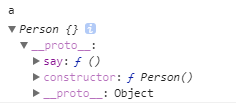
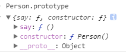
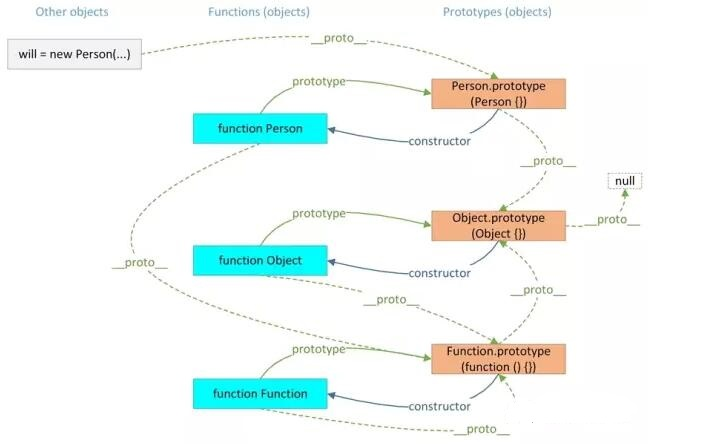

# 继承

## 一、属性 `__proto__` 与 `prototype`
说到继承，就必须得说说 `__proto__` 与 `prototype` 这两个属性。
- `prototype` ：原型，是函数特有的属性。
- `__proto__` ：隐式原型，是对象特有的属性，也被写作 `[[prototype]]`。

我们都知道，一个使用了原型模式的构造函数创建了一个实例后，其实例将会继承构造函数的原型（`prototype`），那么该原型被实例记录在哪呢？就是记录在实例的 `__proto__` 上。如：
```js
function Person(){}
Person.prototype.say = function(){
    return 'Person'
}

var a = new Person()
a.__proto__ === Person.prototype // true
```
我们可以看到实例 `a` 的 `__proto__` 就是构造函数 `Person` 的 `prototype`。在控制台可以看到：  





所以，实例的 `__proto__` 是实例继承其构造器的 `prototype` 的结果。

***

## 二、原型链
什么是原型链？  
在 `js` 中，万物均为对象。实例继承其构造器的原型；构造器也是对象，它也是由构造器构造的，所以它又继承了其构造器的原型；不断的继承就形成了原型链。



- 这里有一个 `Person` 的实例 `will`，该实例继承了 `Person` 构造函数的原型。
- `Person` 构造函数也是一个对象，它由 `Function` 构造器生成。所以，`Person` 构造函数继承了 `Function` 构造器的原型。
- `Function` 构造器函数也是一个对象，它由 `Function` 构造器生成。所以，`Function` 构造函数继承了自己的原型。
- `Object` 构造函数也是一个由 `Function` 构造器生成的对象。所以，`Object` 构造函数继承了 `Function` 构造器的原型。
- `Person`、`Function` 构造函数的原型都是对象，由 `Object` 构造函数生成。所以，`Person`、`Function` 构造函数的原型继承了`Object` 构造函数的原型。
- `Object` 构造函数的原型是对象，它继承的是 `null`。
- 所有函数都继承了 `Function` 构造器的原型。
- 所有对象都继承了其对应构造函数的原型。

```js
Object.prototype.__proto__ === null // true
```


***

## 三、属性 `constructor`
`constructor` 是构造函数的原型内的一个属性，记录着该原型的所属的构造器。
```js
function A(){}
var a = new A()
a.constructor === A // true
A.prototype.constructor === A // true

var b = new Object()
b.constructor === Object // true
Object.prototype.constructor === Object // true
```

之前说过，如果直接更改 `prototype` 整个对象，要同时更改 `constructor`，如:
```js
function A(){}
A.prototype = {
    constructor: A
}

var a = new A()
a.constructor === A // true
```
那么，如果不更改 `constructor`，如:
```js
function B(){}
B.prototype = {}

var b = new B()
b.constructor === B // false
b.constructor === Object // true
```
为什么呢？因为：
```js
var c = {}
c.constructor === Object // true
```

***

END