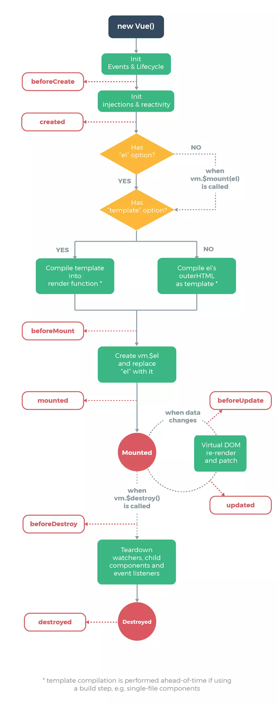

# `Vue` 的实例化流程





在 `Vue` 的依赖包中的 `src/core/instance/index.js` 中：

```js
function Vue (options) {
  if (process.env.NODE_ENV !== 'production' &&
    !(this instanceof Vue)
  ) {
    warn('Vue is a constructor and should be called with the `new` keyword')
  }
  this._init(options)
}
```
在 `new Vue` 的过程中，将会调用实例方法 `_init` 对实例进行初始化。

在 `Vue` 的依赖包中的 `src/core/instance/init.js` 中，定义了 `_init` 方法：
```js
Vue.prototype._init = function (options?: Object) {
  const vm: Component = this

  // a uid
  vm._uid = uid++

  //...略

  // merge options
  if (options && options._isComponent) {
    // optimize internal component instantiation
    // since dynamic options merging is pretty slow, and none of the
    // internal component options needs special treatment.
    initInternalComponent(vm, options)
  } else {
    vm.$options = mergeOptions(
      resolveConstructorOptions(vm.constructor),
      options || {},
      vm
    )
  }

  /* istanbul ignore else */
  if (process.env.NODE_ENV !== 'production') {
    initProxy(vm)
  } else {
    vm._renderProxy = vm
  }

  // expose real self
  vm._self = vm
  initLifecycle(vm)
  initEvents(vm)
  initRender(vm)
  callHook(vm, 'beforeCreate')
  initInjections(vm) // resolve injections before data/props
  initState(vm)
  initProvide(vm) // resolve provide after data/props
  callHook(vm, 'created')

  //...略

  if (vm.$options.el) {
    vm.$mount(vm.$options.el)
  }
}
```

上面只显示主干流程。接下来拆分流程来讲：

```js
vm._uid = uid++
```

上面的代码，是派发唯一 `uid`。

```js
if (options && options._isComponent) {
  // optimize internal component instantiation
  // since dynamic options merging is pretty slow, and none of the
  // internal component options needs special treatment.
  initInternalComponent(vm, options)
} else {
  vm.$options = mergeOptions(
    resolveConstructorOptions(vm.constructor),
    options || {},
    vm
  )
}
```

上面这段代码，判断了传入参数 `options` 是否为一个组件对象，如果是，则用 `initInternalComponent` 为 `vm.$options` 添加一些属性，否则，用 `mergeOptions` 合并配置并赋予实例的 `$options` 属性。

```js
if (process.env.NODE_ENV !== 'production') {
  initProxy(vm)
} else {
  vm._renderProxy = vm
}
```

上面的代码，是为实例 `vm` 添加 `_renderProxy` 属性值，实现实例属性代理。判断当前开发环境是否为 `production`（生成阶段），来分别用不同方法实现实例属性代理。

```js
initLifecycle(vm)
initEvents(vm)
initRender(vm)
initInjections(vm) // resolve injections before data/props
initState(vm)
initProvide(vm) // resolve provide after data/props
```

上面的代码，初始化生命周期，初始化事件中心，初始化渲染，初始化 `data`、`props`、`computed`、`watcher` 等等。

```js
if (vm.$options.el) {
  vm.$mount(vm.$options.el)
}
```
上面的代码用 `$mount` 实例方法进行实例挂载。主要是把挂载的模板渲染成 `DOM`。

***

## 总结
`Vue` 构造器通过 `_init` 入口函数，调用其它函数来初始化配置（生命周期、事件、渲染、初始化 `data`、`props`、`computed`、`watcher` 等待），最后调用 `$mount` 把挂载的模板渲染成 `DOM`。

***
[last -> Vue构造器](./Vue构造函数.md)  
[next -> initLifecycle]()


